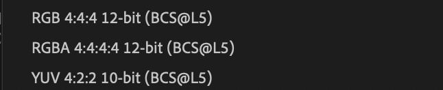
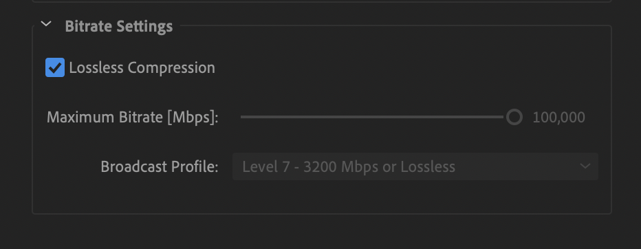

# Video Transcoding and Rewrapping Workflows for PARADISEC Archive

*[PARADISEC](https://paradisec.org) adheres to the current best-practice standards for video archiving as set by the International Association of Sound and Audiovisual Archives [(IASA)](https://www.iasa-web.org/).*

## Video Formats
PARADISEC accepts video content from our depositors that are either analogue and need to be digitised, or are born-digital and need further transcoding or rewrapping. All analogue video digitising is sent to an external company for processing ([DAMSmart!](https://www.damsmart.com.au/)) We do all born-digital video processing in-house.

Digital file formats we accept are the following: .MP4, .MPEG, .MPEG1, .MP2, .MPG, .M4V, .OGG, .MTS, .AVCHD, .AVI, .MOV, .QT, .DV, .WEBM, .WMV

We create two digital files for each video we receive:

* .MXF (lossless JPEG2000) as an archival file
* .MP4 (H.264) as an access file

## Creating lossless JPEG2000 .MXF videos with Adobe Media Encoder (CC 2018 or later)
### Define Encoding Settings - Making an Encoding Preset
The first thing we need to do is select the settings that we can use each time we want to create a lossless J2K .MXF video. To do this, we need to create an Encoding Preset. Go to the top Media Encoder CC menu to “Presets” and then select “Create Encoding Preset”. A new Preset window will open up. Look at the image below to see the settings you should choose. Each will be explained below.

  

### Preset name and format
First you should give the preset a meaningful name, I have chosen **Lossless J2k (8-bit)**. The main reason for this particular name is to differentiate this preset from others you might use for different workflows (I will discus why I add the distinction **8-bit** below).

For the format, select **JPEG 2000 MXF OP1a**. Once you select this format, you are then offered these choices for the *Based on Preset* field:

  

You can leave the new default of **RGBA 4:4:4:4 12-bit (BCs@L5)**. This value will change once we make further refinements in our settings.

Leave the remaining settings in this section as their defaults (*Comments* field left blank, *Export Video* and *Export Audio* boxes ticked).

### Video settings
Edit only settings in the Video and Audio tabs. Settings in the other tabs (Effects, Captions, Publish) should be left untouched.

Because we selected the **JPEG 2000 MXF OP1a** format above, the video codec will automatically be set to **JPEG 2000** in this section. The basic video settings options will have changed to those appropriate for this format.

Make certain **Match Source** is selected, this will automatically tick all the boxes below (if they are not already), retaining the same settings as those of the original file for the following fields *Width*, *Height*, *Frame Rate*, *Field Order*, and *Aspect [ratio]*.

*Chroma* should be set to **YUV 4:2:2** with a *depth* of **8-bit**. In the rare case your original video has a colour depth of 10-bit, select the **10-bit** option. To determine the bit depth of a video, use [MediaInfo](https://mediaarea.net/en/MediaInfo); the file’s bit depth is listed in the MediaInfo metadata output report.

> Note: If you are using CC2018: Set the Broadcast Profile to Level 6 (Lossless). This determines the maximum sampling and bit rates for the output file. You can see all the drop down choices offered below:

  

> Note: If you are using CC2020: You need only tick the box for *Lossless Compression*; The *Maximum Bitrate* and *Broadcast Profile* automatically get set to **100,000 Mbps** and **Level 7 - 3200Mbps or Lossless**, respectively

  

### Audio Settings
There are not many adjustments that need to be made to the audio settings (see image below). The *Audio Codec* will already be set to **Uncompressed** with a *Sample Rate* of **48,000 Hz**. due to the choice of the video format of **JPEG 2000 MXF OP1a**.

  

Make certain the *Channels* field is set to **2**. If you are given a video that has been recorded with surround sound, there could be as many as 6 channels. Our standard is to have 2 channel stereo audio output for our .MXF files. 6 channel video files have caused problems for editing/playback in programs such as Adobe Premiere, etc. Then Set the *Sample Size* to **24 bit**.

### The Remaining Settings
The remaining settings located underneath the tab area should all be left with the default settings (see image below). This means that the following boxes should all be left unticked: *Use Maximum Render Quality*, *Use Previews*, *Set Start Timecode*, and *Render Alpha Channel Only*.

  

Leave the *Time Interpolation* set to **Frame Sampling**. This settings handles motion smoothing if you change the output file’s frames per second.

### Explanation of the Settings
* **JPEG 2000 MXF OP1a** is the MXF (Material Exchage Format) Operational Pattern 1a (OP1a), with lossles JPEG 2000 in a generic container *(for more information: https://www.loc.gov/preservation/digital/formats/fdd/fdd000206.shtml)*.

* **YUV 4:2:2** with a depth of **8 bit** is the *Chroma Subsampling* suggested by IASA for born-digital .MXF. **Y** (or often **Y′**) stands for the *luma*, or *brightness*, *component*; **U** and **V** are the two *colour components*. YUV colour encoding takes into consideration human perception thus creating an output that has masked any human-noticable distortions *(for more information: https://en.wikipedia.org/wiki/YUV)*.

* **4:2:2** denotes the *vertical* and *horizontal subsampling* *(for more information: https://poynton.ca/PDFs/Chroma_subsampling_notation.pdf)*.

* **8-bits** per channel is typically the *bit depth* for many of the original .MOV, .MTS, .AVI, .MP4, etc. video files we handle. Using a 10-bit depth would needlessly increase the file-size while adding no improved quality.

* **Broadcast profile** determines the maximum sampling and bit rates of the output file. **Level 6 lossless (L6)** is 520 Msamples/s and 1600Mbits/s. **Level 7 lossless (L7)** is 520 Msamples /s and and unspecified Max Bitrate.

* For further information of the **Media Encoder export settings** mentioned above: *https://helpx.adobe.com/au/media-encoder/using/export-settings-reference.html*.
